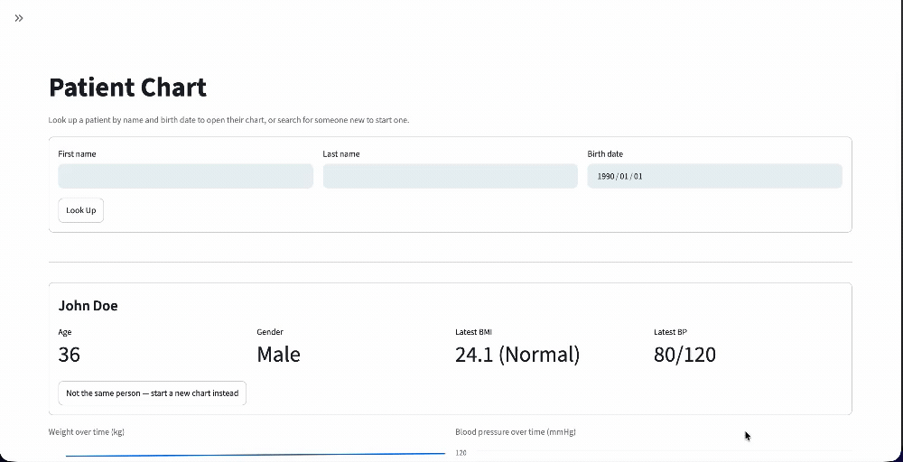
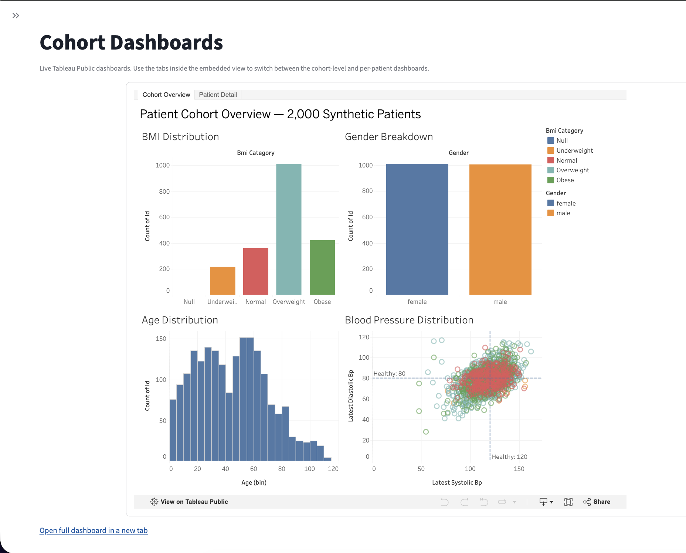
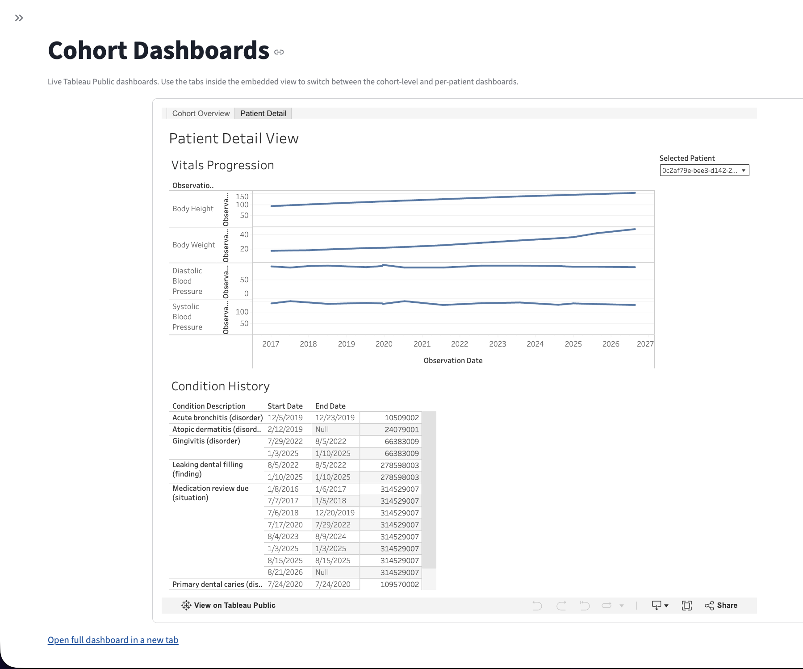

# de-pipeline

A FHIR-based clinical data platform: batch ingestion of synthetic patient records into Postgres, a FastAPI backend for both automated ingestion and manual clinical intake, a Streamlit dashboard built to feel like something a clinician would actually use during a visit, and a Tableau-fed analytics layer on top. This README also doubles as a build log — the "why" behind the choices below mattered more to me while building this than it will to most readers, but it's here because most of what's actually worth learning from a project like this lives in the reasoning, not the final diff.

## What it does

1. Synthetic FHIR patient bundles (generated via Synthea) land in object storage (Cloudflare R2) as a compressed archive.
2. A batch worker streams through that archive, extracts the clinically relevant fields out of each bundle, and upserts them into Postgres — idempotently, so re-running the same archive twice never duplicates or corrupts data.
3. A FastAPI service sits in front of that database, exposing both the automated ingestion path and a manual clinical-entry path a front desk or clinician could use directly.
4. A Streamlit dashboard consumes that API and presents it the way an EHR would: look up a patient, see their chart, log a new visit.
5. A separate export script flattens the same data into CSVs for a Tableau cohort-analysis dashboard, since Tableau Public can't connect to Supabase live.

```
Synthea (synthetic FHIR generation)
        |
        v
Cloudflare R2 (raw bundle archive)
        |
        v
worker/batch_ingest.py  --(bad records)--> R2 dead-letter queue
        |
        v
Postgres (Supabase)  <---------------------+
        |                                  |
        v                                  |
api/main.py (FastAPI)  ---(manual intake)--+
        |
        v
dashboard/app.py (Streamlit)          tableau/csv_export.py --> Tableau
```

## Tech stack

Python (FastAPI, asyncpg, Pydantic, Streamlit, boto3, Locust), Postgres via Supabase, Cloudflare R2 for object storage, Tableau for cohort analytics, GitHub Actions for CI, pytest for testing.

## Running it locally

Copy `.env.example` to `.env` and fill in `DATABASE_URL` (a Postgres connection string) and the `R2_*` credentials if you're running the batch worker.

```bash
pip install -r requirements.txt

# apply the schema to your database
psql "$DATABASE_URL" -f db/schema.sql

# run the API
uvicorn api.main:app --reload

# run the dashboard (in a separate terminal)
streamlit run dashboard/app.py

# run the batch worker against an archive already sitting in R2
python -m worker.batch_ingest
```

## Testing

```bash
pytest tests/ -v
```

`tests/test_extraction.py` covers the pure parsing/calculation logic with no network or database dependency. `tests/test_api.py` runs against a real (test) database and covers the full API surface, including the identity-collision flow end to end. Both run automatically on every push and PR to `main` via `.github/workflows/ci.yml`, which spins up a throwaway Postgres 16 container for the duration of the run.

To reproduce the load-testing numbers above:

```bash
# terminal 1
POOL_MAX_SIZE=10 uvicorn api.main:app

# terminal 2
locust -f tests/locustfile.py --host http://127.0.0.1:8000 \
  --headless --users 100 --spawn-rate 10 --run-time 1m
```

Swap `POOL_MAX_SIZE` and `DATABASE_URL` (direct connection vs. the transaction-pooler connection string, port `6543`) to reproduce the other configurations.

## Repo layout

| Path | What it is |
|---|---|
| `worker/batch_ingest.py` | Batch ETL entry point — pulls the archive from R2, parses each bundle, chunks upserts to Postgres, routes failures to a dead-letter queue. |
| `shared/extraction.py` | FHIR parsing: pulls vitals and blood-pressure components out of raw bundle JSON, computes BMI, generates deterministic child-row IDs. |
| `shared/queries.py` | All raw SQL — upserts for the batch worker, reads for the API. |
| `shared/models.py` | Pydantic request/response schemas shared between the API and its tests. |
| `api/main.py` | The FastAPI service — ingestion, manual intake, patient lookup, observation history, patient snapshot. |
| `dashboard/app.py` | The Streamlit clinical dashboard. |
| `db/schema.sql` | Table definitions and indexes for `patients`, `observations`, `conditions`. |
| `tableau/csv_export.py` | Flattens the DB into CSVs for the Tableau workbook. |
| `tests/` | Unit tests (pure extraction logic, no DB) and integration tests (real test DB, run in CI). |
| `tests/locustfile.py`, `tests/locustfile_baseline.py` | Load-test definitions used in the connection-pooling investigation below. |
| `.github/workflows/ci.yml` | Spins up an ephemeral Postgres container and runs the full test suite on every push/PR to `main`. |

## Design decisions worth explaining

**Idempotent upserts, not inserts.** Every write in `shared/queries.py` is an `ON CONFLICT (id) DO UPDATE`, using `COALESCE(new_value, existing_value)` so a partial or repeated record updates a row instead of duplicating it or nulling out fields the new record simply didn't include. Combined with `uuid.uuid5` (deterministic UUIDs derived from stable input, not random) for the blood-pressure sub-observations, this means the entire batch pipeline can be re-run against the same source data any number of times and converge to the same end state. That property — safe to re-run — mattered more to me than making the happy path fast, because in a real pipeline the happy path isn't the one that determines whether you trust the system.

**A dead-letter queue instead of a crash.** `batch_ingest.py` treats a malformed bundle as expected, not exceptional: encoding errors, JSON errors, and extraction failures are all caught individually, and the offending record (plus the reason) gets written to a `dlq_errors/` prefix in R2 instead of taking down the whole run. One bad file three thousand records into an archive shouldn't cost you the other 2,999.

**The name+DOB collision problem, solved with a human in the loop instead of a heuristic.** Two different real patients can share a first name, last name, and birth date — it's a genuine identity-resolution problem, not an edge case to shrug off. Rather than silently merging on that match (risky — could conflate two different people's charts) or silently creating a duplicate every time (defeats the point of matching at all), `/api/patients/lookup` surfaces a candidate match to the person entering data and lets *them* confirm whether it's the same patient. If they say no, `force_new: true` bypasses the match and creates a distinct record anyway. The match logic lives in the database; the judgment call about whether two candidate records are really the same human stays with a person, which is where it belongs.

**The dashboard is built around a visit, not a data table.** Early versions just listed rows. The current one asks: who is this patient, have we seen them before, what's their trend over time, what happened at this visit — the actual sequence of a clinical encounter. That's a sidebar-navigated, lookup-then-chart flow using `st.session_state` to carry the active patient across Streamlit's rerun-on-every-interaction execution model, with vitals pivoted into wide format for trend charts. It's a small thing, but it's the difference between "a script that shows data" and "a tool someone could plausibly open during their workday."

## The connection-pooling investigation

This is the part of the project I'd actually walk an interviewer through, because it has a real hypothesis, a controlled experiment, a wrong first read of the data, and a corrected conclusion.

**The question:** the API's database pool defaulted to a single connection (`max_size=1`) as a Supabase free-tier accommodation. How much does that actually cost under concurrent load, and does routing through Supabase's managed PgBouncer-based transaction pooler (as opposed to just raising the pool size on a direct connection) help further?

**The method:** `POOL_MAX_SIZE` was made configurable via environment variable specifically so the pool size could change between runs without editing and reverting application code. Four Locust runs were captured, all at an identical load profile — 100 simulated users, ramped at 10/s, sustained for 60 seconds — hitting `GET /api/health` and `GET /api/patients`:

| Configuration | Requests | Failures | Median | p99 | Throughput |
|---|---|---|---|---|---|
| No database (`/openapi.json` only — the ceiling) | 10,935 | 0 | 2 ms | 6 ms | 185.1 req/s |
| Direct connection, `max_size=1` | 232 | 0 | 22.0 s | 25.0 s | 3.9 req/s |
| Direct connection, `max_size=10` | 2,217 | 0 | 2.1 s | 2.4 s | 37.5 req/s |
| Supabase transaction pooler, `max_size=15` | 3,230 | 0 | 1.3 s | 1.4 s | 54.6 req/s |

**What it shows:** going from a single connection to ten dropped the median response time from 22 seconds to 2.1 seconds and raised throughput 9.6x. That's not a subtle effect — with one connection, every concurrent request queues behind whichever request currently holds it, and under sustained load that queue never drains; latency climbs for as long as the load is sustained rather than settling anywhere. Ten connections gave the system enough slack to reach a stable state instead of an ever-growing one.

Routing that same kind of workload through Supabase's transaction-mode pooler (Supavisor, PgBouncer-compatible) — with the app's own client-side pool set to 15 — pushed both metrics further: 46% more throughput and 38% lower median latency than the direct 10-connection pool. Two honest caveats on that comparison: the client-side pool sizes weren't identical between those two runs (10 vs. 15), so this isn't a perfectly isolated test of "pooling mechanism" alone — some of the gain could just be the larger number of slots. And my first read of that run was actually wrong: watching the live console output, the percentiles were tightly bunched together in a way that visually resembled the `max_size=1` collapse, and I initially assumed the managed pooler was somehow being throttled down to similarly poor performance. Pulling the actual numbers afterward showed that read was backwards — tightly bunched percentiles just mean the system reached a stable operating point, not that the point is bad. This run's stable point beat the direct-connection pool on every axis. Worth stating plainly: the visual shape of a percentile spread told me *whether* a system had stabilized, not *how well* — I'd conflated the two.

Even the best-performing configuration here reaches only about 30% of the zero-database ceiling (54.6 of 185.1 req/s), which is itself the more durable finding: a network round trip and a real query execution against Postgres is an irreducible cost that no amount of pool tuning eliminates — tuning only changes how gracefully the system degrades under concurrent load, not whether that cost exists at all. `statement_cache_size=0` (needed for asyncpg compatibility with transaction-mode pooling, since prepared statements are tied to a specific physical connection and PgBouncer can route different queries on the same logical connection to different physical backends) held up cleanly across every run — zero query errors in any configuration.

## Known limitations / what I'd do next

The batch worker's `executemany` calls for a patient's demographics, observations, and conditions aren't wrapped in an explicit transaction. A crash mid-chunk could leave a patient row written without its associated observations or conditions. The fix is straightforward (`async with conn.transaction():` around each chunk), just not yet done.

Running multiple API instances behind a load balancer (`uvicorn --workers N` as the simplest local approximation) would multiply the number of database connections by however many workers are running, since each worker builds its own independent pool in its own `lifespan`. That's worth accounting for explicitly before scaling horizontally against a connection-limited managed Postgres instance — it's exactly the kind of problem a shared external pooler (like the one tested above) is meant to solve once there's more than one application process competing for the same database.

## Screenshots / demo

**The identity-collision safety net, end to end:** looking up a patient whose name and birth date match an existing record, confirming it's actually a different person, and seeing the new chart tracked separately with its own vitals.

<!--  -->

**Cohort-level analytics (Tableau, embedded in the dashboard):**



